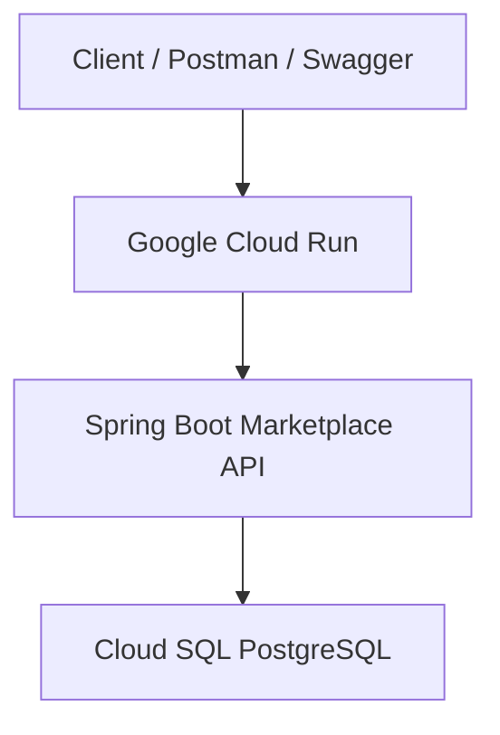

# Architecture

```text
Client / Postman / Swagger
        |
        v
Google Cloud Run
        |
        v
Spring Boot Marketplace API
        |
        v
Cloud SQL PostgreSQL
```



## Runtime Modules

- Controllers expose the HTTP API.
- DTOs define request and response payloads.
- Services hold business rules.
- Repositories handle database access through Spring Data JPA.
- Entities model persistent marketplace data.
- Flyway owns schema migrations.

## Order Flow

```text
POST /api/orders
        |
        v
OrderService
        |
        +-- validate customer
        +-- validate products
        +-- check inventory
        +-- calculate total
        +-- reduce stock
        +-- save order and items
        +-- create notification
```
